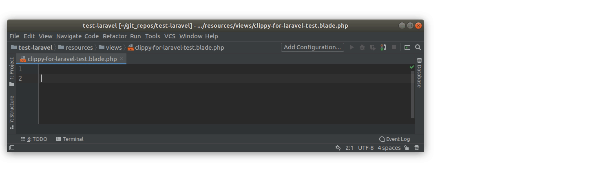

# Clippy for Laravel

</img>

This package brings possible the most important feature of all time to the Laravel
framework. With this easy to use package, anyone can make use of the all powerful
Clippy assistant. Now featuring cloud-based advanced machine-learning blockchain 
synergy which will revolutionise your Laravel application.

## Installation

Just run the following Composer command from the root of your project.

```bash
composer require divineomega/clippy-for-laravel
```

## Usage

Just add the following to any Blade file.

```blade
@clippy('It looks like you are writing a Laravel app. Would you like help with that?')
``` 

It also works with variables so you can all important data down from your controllers
or view composers.

```blade
@clippy($earthShatteringlyImportantMessage);
```
